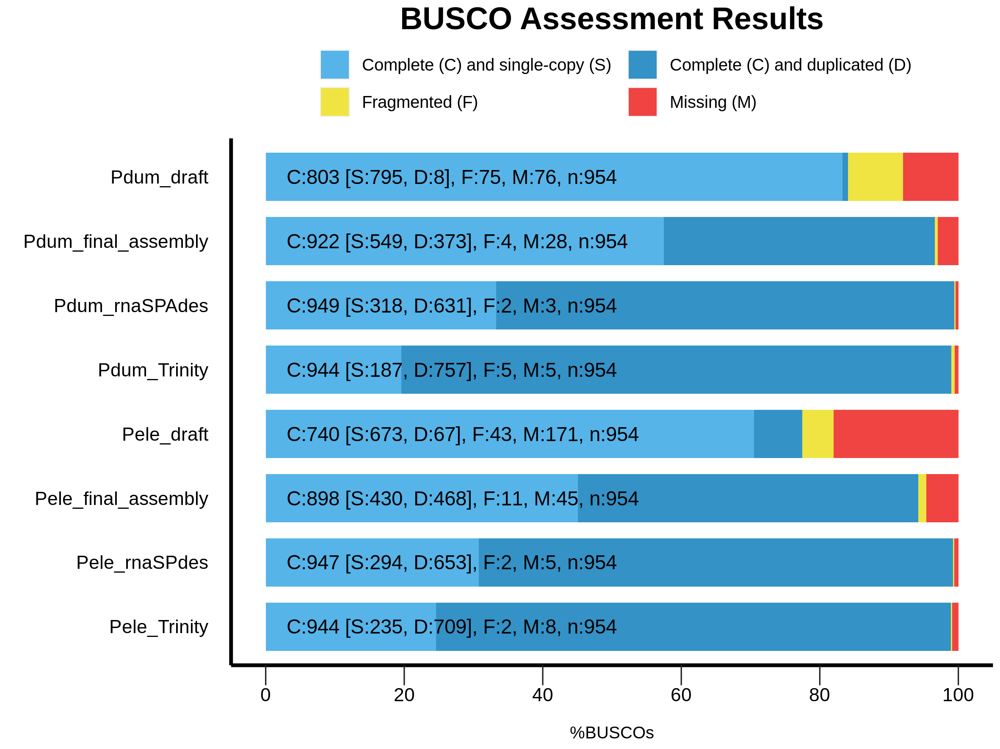

# Analysis of developmental gene expression dynamics during anterior and posterior regeneration of *Platynereis dumerilii (Nereididae, Annelida)* and *Pygospio elegans (Spionidae, Annelida)*.

Authors: 

- Elena Novikova, The Zoological Institute of Russian Academy of Science (supervisor)
- Maksim Nesterenko, All-Russia Research Institute for Agricultural Microbiology (supervisor)
- Sergei Fomenko (S)
- Dudkovskaia Anastasiia (A)

We analysed gene expression changes during regeneration of two Annelida, *Pygospio elegans*, capable of anterior and posterior regeneration, and *Platynereis dumerilii*, capable of only posterior regeneration. Given the homeobox genes play a key role in the anteroposterior axis patterning and organs morphogenesis, we aimed to study the expression pattern of this superfamily of transcription factors during anterior and posterior regeneration.

## Aim, tasks and data
Samples of *P.elegans* and *P.dumerilii* were collected for bulk RNA sequencing during anterior (data marked as 'tail') and posterior regeneration (data marked as 'head') in 6 time points (0, 4, 12, 24, 48, and 96 hours after injury). The **available data** at the start of the project were: 24 RNA-seq (2 species * 2 sites * 6 time points) datasets of reads after basic quality check and trimming, same reads after decontamination with [MCSC Decontamination method](https://github.com/Lafond-LapalmeJ/MCSC_Decontamination) and draft <em>de novo</em> [Trinity](https://github.com/trinityrnaseq/trinityrnaseq/wiki) transcriptome assemblies for P.elegans and P.dumerilii. 

**Aim**: find and reveal phylogenetic history of genes involved in anterior and posterior regeneration in Annelida worms *P. elegans* and *P. dumerilii*

  

**Objectives**:

  

-   Compare transcriptome assemblies quality’s and completeness performed with different algorithms (Trinity, rnaSPAdes) (S)
    
-   Study batch-effects for differential expression analysis (A)
    
-   Identify genes from Homeobox Superfamily in transcriptomes using HMMSearch, [eggNOG-mapper](http://eggnog-mapper.embl.de/) and Orthofinder (S)
    
-   Build phylogenetic trees for homeobox-genes and analyse their expression dynamics during various stages of regeneration (S)
    
-   Identification of co-expression clusters (A)
    
-   Analysis and visualization of the GO-enrichment with genes demonstrating a coordinated change in expression (A)

## Improvement of <em>de novo</em> transcriptome assemblies
Workflow for this part of analysis:

Alternative decontamination method with [Kraken2](https://github.com/DerrickWood/kraken2) (v.2.1.2) was used to improve decontamination quality. Commands were performed on supervisors server due to high computational demands of this part of analysis. Scripts used for decontamination can be found in **01_02_decontamination_assembly\01_kraken2** folder. Kraken2 reports visualisation performed online with [Pavian](https://fbreitwieser.shinyapps.io/pavian/).
 

To further improve assemblies completeness 2 different assemblers were used - [rnaSPAdes](https://cab.spbu.ru/software/rnaspades/) (v.3.15.4) and [Trinity](https://github.com/trinityrnaseq/trinityrnaseq/wiki)(v.2.14.0). Commands can be found in **01_02_decontamination_assembly\02_rnaSPades** and **01_02_decontamination_assembly\03_Trinity** folders.

Contigs quality from both assemblies was evaluated with [TransRate](https://hibberdlab.com/transrate/installation.html) (v.1.0.1), contigs with high scores were clusterised with [CDHIT-est](https://github.com/weizhongli/cdhit) (v.4.8.1) (threshold c=0.95 used for  duplicated sequence removal according to CDHIT user guide). Protein-coding ORFs in contigs were identified by [Transdecoder](https://github.com/TransDecoder/TransDecoder) (v.5.5.0), proteins with .
Gene expression was quantified with [Salmon](https://github.com/COMBINE-lab/salmon) (v.1.2.1). For further analysis we used contigs with protein length > 100 aminoacids and expression level > 2 TPM at least in one time point.  
[BUSCO](https://gitlab.com/ezlab/busco) (v.5.4.4) completeness analysis against Metazoa odb10 orthologs database for draft assemblies and 3 assemblies after decontamination was conducted.
On this picture you can see BUSCO assemblies completeness for each Annelida for draft assemblies (MCSC decontamination method), assemblies in rnaSPAdes and Trinity after decontamination using KRAKEN2 standard database and final assemblies (merged assembly after clusterization using CDHIT-est and filtering)
 
We can clearly see that decontamination with KRAKEN2 and clusterisation of 2 different assemblies improved transcriptomes completeness as compared to draft assembly. But during rnaSPAdes and Trinity assemblies clusterisation and filtration a small number of genes were lost (probably due to their low level of expression).

## Transcriptomes annotation
Visualisation of forkflow:

[eggNOG-mapper](http://eggnog-mapper.embl.de/)(default settings) and [HMMsearch](https://github.com/EddyRivasLab/hmmer)(e-value<1-e3) against the PfamA database were used for transcriptomes annotation and protein domains identification. Orthogroups identification between Annelida species studied and various metazoan species was carried out with reference proteomes from UniProt database  and proteinortho and OrthoFinder software. Commands and detailed descriptions for this part of analysis can be found in **03_annotation** folder.
Reference proteomes that were used (protein length >100 aminoacids to match TransDecoder output, BUSCO proteome completeness > 90%):
- *Apis mellifera* (Insecta, outgroup)
- *Homo sapiens* (outgroup)
- *Biomphalaria glabrata* (Mollusca)
- *Crassostrea gigas* (Mollusca)
- *Lottia gigantea* (Mollusca)
- *Pomacea canaliculata* (Mollusca)
- *Capitella teleta* (Annelida)
- *Dimorphilus gyrociliatus* (Annelida)
- *Owenia fusiformis* (Annelida)

Heatmap visualisation for number of pairwise orthologs found between species with proteinortho:\

We can see that number of orthologs between evolutionary close species is higher. The abnormally high number of orthologs between most species and *C.gigas* is probably due to the large size of *C.gigas* proteome (>70k proteins).  

## Batch-effect estimation and correction

Given the differences in PCR cycles between *P. elegans* samples, we performed batch-effect analysis using the [ComBat-seq](https://github.com/zhangyuqing/ComBat-seq) package for the R programming language.

We noticed that there is no significant difference between data from different libraries, contrast, after using ComBat-seq most of biological differences were smoothed. Adding more biological variables to analysis needs ComBat-seq optimization. So we used uncorrected data.

## Co-expression gene clusters identification

We use [Clust](https://github.com/BaselAbujamous/clust) (v.1.18.0)

We obtain 8 clusters in both *P.elegans* posterior and anterior regeneration sites. And we obtain 4 clusters in *P.dumerilii* anterior and 9 in *P.dumerilii* posterior regeneration sites. In total, the clusters included about 42 percent of the analyzed sequences. In 18 clusters homeobox-containing sequences were found.

Here we present one cluster from anterior regeneration of *P.elegans*. This cluster contain 5253 genes. 

All result in the foalder "Clust".

## GO-terms enrichment analysis

GeneOntology (GO) terms enrichment analysis was performed for each co-expressed gene cluster using the [topGO](https://bioconductor.org/packages/3.16/bioc/html/topGO.html) (v.2.52.0.) package for R. Only biological processes including more than 10 significant genes were considered. We used [rrvigo](https://bioconductor.org/packages/release/bioc/html/rrvgo.html) (v.3.17) and parental GO-terms for enrichment analysis results visualization.
After visualisation of GO-enrichment analysis results, we noticed that posterior regeneration processes in *P.dumerilii* , and *P.elegans* are similar.
In *P.elegans* interior clusters that include homeobox genes, we see a wide variety of development and proliferation processes, while the number of processes involved in regeneration and development is  lower in *P.dumerilii*.
Here we present a part of enriched GO-term cloud from anterior regeneration of *P.elegans*.

## Phylogenetic analysis
Visualisation of forkflow:\

\
For 2 homeobox gene families (NKX2 and PBX) with meaningful orthologs according to Orthofinder or proteinortho phylogenetic analysis was performed. 
These gene families were chosen because they exhibit interesting expression patterns according to differential expression analysis. PBX1-like genes expressed during anterior regeneration in *P.elegans* but not *P.dumerilii*. NKX2-like genes play role in central neural system developement, different genes from these family expressed during anterior or posterior regeneration in both Annelids.

Multiple protein alignment generated with [MAFFT online servise](https://mafft.cbrc.jp/alignment/server/) using additional homologues from PSI-BLAST to improve the quality of alignment between genes of evolutionarily distant species. Model selection and phylogenetic tree construction performed in [IQ-TREE](https://github.com/iqtree/iqtree2)(v.2.2.2.3). For tree visualisation [FigTree](http://tree.bio.ed.ac.uk/software/figtree/) (v.1.4.4) used. eggNOG short gene names and data about gene expression clusters from Clust were manually added in FigTree. Сommands and detailed descriptions for this part of analysis can be found in **04_phylogeny** folder.

Phylogenetic tree for PBX-like genes:

We see that the architecture of this tree corresponds to the generally accepted ideas about the Spiralia evolution (*O.fusiformis* is a most basal Annelida, *P.elegans* close to *C.teleta*, Annelida and Mollusca are monophyletic groups). Interestingly, the only PBX-4-like gene among Spiralia has been identified in *P.elegans*, its role in anterior regeneration requires further evaluation.

Phylogenetic tree for NKX2-like genes:

We see more complex architecture with precense of 3 paralogous NKX2-like genes groups in *P.dumerilii* and *P.elegans*. Low bootstrap support for NKX2-1-like genes phylogeny probably related to low numbers of identified orthologs in Spiralia for these genes and requires further evaluation.

## Future plans

- In order to reduce the artificial redundancy of the combined assembly of the transcriptome, we will test a new approach based on the construction of protein clusters, followed by the selection of a representative sequence in each cluster
- Comparison of protein-protein interactions and protein spatial structures for differentially expressed homeobox proteins in *P.elegans* and *P.dumerillii*
- Expression analysis of other regeneration/development-related genes 
- Determining the phylogenetic origin of genes related to development using [phylostratigraphy techniques](https://github.com/arendsee/phylostratr) 

